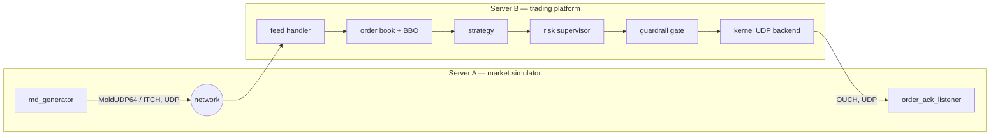

# Low-Latency Execution Gateway

[](https://github.com/AB-Coder96/low-latency-execution-gateway)
[](https://en.cppreference.com/w/cpp/20)
[](https://cmake.org/)

A systems-engineering testbed for the low-latency techniques used in HFT execution paths: real NASDAQ wire protocols (ITCH, OUCH, MoldUDP64), a lock-free SPSC ring, a software risk/guardrail gate, and — as of this phase — a real two-host market-data-in, order-out round trip over UDP, measured end to end rather than claimed.

## What this is

This gateway decodes and encodes real NASDAQ TotalView-ITCH, OUCH, and MoldUDP64 wire formats byte-for-byte, builds a per-symbol order book from them, and runs a configurable risk/guardrail check — a software model of the hardware-gated decision path this architecture is designed around — before handing an order to a pluggable execution backend (kernel UDP today; DPDK and AF_XDP scaffolding for later). Phase 1 adds the piece that was missing before: a synthetic market-data generator and a live feed-handling engine that actually talk to each other over the network, so every number this project reports is something that was measured, not asserted.

## Architecture



Everything left of the network is the generator side; everything right of it is the same book → risk → gate → execution pipeline the project already had, now driven by live traffic instead of only unit tests and benchmarks.

## Getting started

Requirements: a C++20 compiler, CMake 3.20+, and Linux (the networking and timestamp code uses POSIX sockets and `SO_TIMESTAMPING` directly).

```bash
cmake -S . -B build/debug -DCMAKE_BUILD_TYPE=Debug -DFGEP_BUILD_TESTS=ON -DFGEP_BUILD_APPS=ON
cmake --build build/debug
ctest --test-dir build/debug --output-on-failure
```

## Running it

In one terminal, start the trading side:

```bash
./build/debug/apps/fgep_live_engine
```

In another, start the exchange side:

```bash
./build/debug/apps/fgep_order_ack_listener
./build/debug/apps/fgep_md_generator
```

`fgep_md_generator` prints a running summary as it sends synthetic ITCH order flow; `fgep_order_ack_listener` logs every order it decodes, with a receive timestamp on each one:

```
fgep_md_generator: sending to 127.0.0.1:30001 (3 symbols, 1000 msg/s target)
fgep_md_generator: sent 3/3 session-open messages
fgep_md_generator: sent 2713 messages, 0 failures, 153844 bytes, 2.99817s elapsed (stopped by signal)

fgep_order_ack_listener: listening on 0.0.0.0:30002 (kernel timestamping active)
fgep_order_ack_listener: order #1 user_ref_num=42 side=buy qty=250 symbol=AAPL price=1000500 receive_ts_ns=622128166251
```

(That output is from an actual local run, not illustrative sample text.)

For a full round-trip report — packet counts, decode errors, sequence gaps, and RTT percentiles — run:

```bash
./build/debug/apps/fgep_round_trip_report
```

## Repository layout

The core library and binaries are namespaced/prefixed `fgep` internally, a holdover from this project's original working name — it isn't the project's name, just its build-time identifier.

```
include/fgep/      public headers, mirrors src/ by module
src/gen/           synthetic ITCH/MoldUDP64 traffic generation
src/net/           UDP send/receive, kernel timestamp capture
src/book/          per-symbol, per-venue order books and BBO
src/risk/          per-order risk checks
src/gate/          software guardrail gate
src/execution/     pluggable execution backends (kernel UDP, DPDK, AF_XDP)
apps/              the runnable pieces: generator, listener, live engine, reports
tests/             one test binary per component, registered in tests/CMakeLists.txt
docs/              protocol references, runtime memory model, network benchmarking notes
```

## Testing

Every component has its own test binary; there's no shared test framework dependency by default (GoogleTest can be enabled via `-DFGEP_ENABLE_GOOGLETEST=ON` for the handful of tests that use it). `ctest` runs all of them. As of this phase, that includes real loopback network tests, not just protocol round-trip checks — `ctest` is genuinely exercising sockets, not only pure logic.

## Status / Roadmap

**Phase 1 — market simulation, correctness: done.** A synthetic market-data generator, a live feed-handling engine, and an order/ack listener now exchange real UDP traffic end to end, with a round-trip report to show for it.

Everything past this point is not yet built. In priority order:

| Phase | What it adds | Status |
|---|---|---|
| 1 | Market simulation — generator, live engine, listener, round-trip report | ✅ done |
| 2 | Latency tuning — fixed-capacity hot-path containers, CPU/IRQ isolation, tuned EC2 pair | ⬜ not started |
| 3 | Live dashboard — real-time metrics and controls, embedded in the existing web stack | ⬜ not started |
| 4 | Real market data — historical session replay, dashboard-selectable | ⬜ not started |
| 5 | Hardware-clock timing — PTP-synchronized one-way latency, not just round trip | ⬜ not started |
| 6 | Continuous benchmarking — CI-driven performance history over time | ⬜ not started |

The gap between "works" and "fast" is deliberate: Phase 1 proves the pipeline is correct on inexpensive, always-on hardware before Phase 2 spends any effort — or any money — on the tuning that only matters once correctness isn't in question.

## Why this exists

This is a systems-engineering project, not a production trading system: it applies the protocols, concurrency patterns, and measurement discipline used in real low-latency execution paths, and is explicit about what's real (protocol parsing, the lock-free queue, the measured round trip) versus modeled (synthetic order flow, no live matching engine, a software stand-in for a hardware-gated decision path) at every stage.

## License

Not yet chosen — add one before making this repository public.